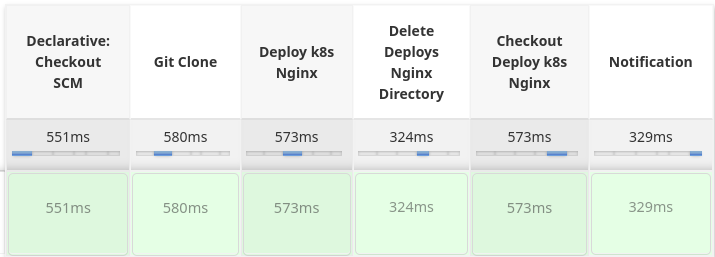

* Clone esse repositorio

* Suba o Jenkins com o docker compose

* Configure o container do Jenkins com a chave .pem da Aws:
 mkdir -p /var/jenkins_home/chaves/
 cd /var/jenkins_home/chaves/
 touch sua_chave.pem #cole o conteudo da chave .pem
 chmod 400 sua_chave.pem

* Configure o Jenkis para receber o arquivo Jenkinsfile na pipeline.
* Pipeline rodando com sucesso:

